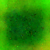

# YOLOv5 Adversarial Training

This repository contains scripts for applying adversarial patches to a YOLO dataset and training a robust YOLOv5 model using adversarial training.

## Overview

Adversarial training is a defensive technique that trains models on adversarial examples to make them more robust against adversarial attacks. This repository provides tools to:

1. Generate adversarial patches using gradient-based optimization
2. Apply adversarial patches to a YOLO dataset
3. Train a YOLOv5 model on the adversarially patched dataset

## What Are Adversarial Patches?

Adversarial patches are specially crafted images designed to fool object detectors when placed in a scene. Unlike traditional adversarial examples that require modifying the entire image, patches can be printed and placed in the physical world to attack detectors in real-time.



In simple terms:
- **Normal image**: The detector correctly identifies objects
- **Image with adversarial patch**: The detector fails to identify objects or misclassifies them

Our implementation follows the equation:
```
y' = patch + (x, y, w, h)
```
Where:
- `y'` is the modified image with the patch
- `patch` is the adversarial patch
- `(x, y, w, h)` are the coordinates from the YOLO labels that specify where to apply the patch

## Setup

1. Clone the YOLOv5 repository (if you haven't already):
   ```bash
   git clone https://github.com/ultralytics/yolov5
   cd yolov5
   pip install -r requirements.txt
   ```

2. Ensure you have the necessary dependencies:
   ```bash
   pip install torch torchvision tqdm pillow easydict numpy
   ```

3. Fix for Pillow compatibility issues:
   - If you encounter `AttributeError: module 'PIL.Image' has no attribute 'ANTIALIAS'` error, we've created a fix:
   ```bash
   # The pillow_fix.py module is automatically imported in train_adversarial.py
   # It handles the ANTIALIAS deprecation by using Image.LANCZOS instead
   ```

## File Structure

- `adv_patch_gen/apply_patch_to_dataset.py`: Script to apply adversarial patches to a dataset
- `adv_patch_gen/utils/patch.py`: Contains PatchTransformer and PatchApplier classes
- `train_patch.py`: Script to generate adversarial patches
- `train_adversarial.py`: Script to create a patched dataset and train a YOLOv5 model
- `test_patch.py`: Script to test adversarial patches on images
- `run_adv_training.sh`: Convenient shell script to run the full adversarial training pipeline
- `pillow_fix.py`: Module that fixes Pillow compatibility issues

## Detailed Implementation

### Key Components

1. **PatchTransformer** (in `adv_patch_gen/utils/patch.py`):
   
   This class handles the transformation of the patch based on the label coordinates:
   
   ```python
   # Key transformation steps
   # 1. Scale the patch size based on bounding box dimensions
   tsize = np.random.uniform(*self.t_size_frac)
   w_size = lab_batch_scaled[:, :, 3].mul(tsize)  # width
   h_size = lab_batch_scaled[:, :, 4].mul(tsize)  # height
   target_size = torch.sqrt(w_size**2 + h_size**2)
   
   # 2. Get target position from labels
   target_x = lab_batch[:, :, 1].view(np.prod(batch_size))  # x center
   target_y = lab_batch[:, :, 2].view(np.prod(batch_size))  # y center
   ```

2. **PatchApplier** (in `adv_patch_gen/utils/patch.py`):
   
   This class handles the actual application of the patch to the image:
   
   ```python
   def forward(self, img_batch, adv_batch):
       advs = torch.unbind(adv_batch, 1)
       for adv in advs:
           if self.patch_alpha == 1:
               # Direct replacement
               img_batch = torch.where((adv == 0), img_batch, adv)
           else:
               # Alpha blending
               alpha_blend = self.patch_alpha * adv + (1.0 - self.patch_alpha) * img_batch
               img_batch = torch.where((adv == 0), img_batch, alpha_blend)
       return img_batch
   ```

3. **Apply Patch to Dataset** (in `adv_patch_gen/apply_patch_to_dataset.py`):
   
   The main function that processes images and applies patches:
   
   ```python
   # Apply patch
   with torch.no_grad():
       adv_batch_t = patch_transformer(
           patch_tensor,
           label_tensor,
           image_size,
           use_mul_add_gau=use_augmentation,
           do_transforms=use_augmentation,
           do_rotate=use_augmentation,
           rand_loc=False  # Use exact label positions
       )
       patched_img_tensor = patch_applier(img_tensor, adv_batch_t)
   ```

## Step-by-Step Guide

### Option 1: Using the Shell Script (Recommended)

We've created a convenient shell script that automates the entire process:

```bash
./run_adv_training.sh
```

This script:
1. Checks for the existence of required files and directories
2. Creates a timestamped output directory
3. Cleans up any existing patched datasets
4. Applies the adversarial patch to your dataset
5. Trains the YOLOv5 model on the patched dataset

### Option 2: Complete Adversarial Training Pipeline

To apply patches to your dataset and train a YOLOv5 model in one step:

```bash
python train_adversarial.py \
    --patch /home/jye00001/fsdata/yolov5_adversarial/data/patch/e_100.png \
    --dataset /home/jye00001/fsdata/yolov5_adversarial/data/datasets/Adversarial_Trainning \
    --patched-dataset /home/jye00001/fsdata/yolov5_adversarial/data/datasets/Adversarial_Trainning_patched \
    --epochs 100 \
    --batch-size 16 \
    --weights yolov5s.pt
```

### Option 3: Create Patched Dataset Only

If you only want to create a patched dataset without training:

```bash
python train_adversarial.py \
    --patch /home/jye00001/fsdata/yolov5_adversarial/data/patch/e_100.png \
    --dataset /home/jye00001/fsdata/yolov5_adversarial/data/datasets/Adversarial_Trainning \
    --skip-training
```

Or directly use the dataset patching script:

```bash
python -m adv_patch_gen.apply_patch_to_dataset \
    --patch /home/jye00001/fsdata/yolov5_adversarial/data/patch/e_100.png \
    --dataset /home/jye00001/fsdata/yolov5_adversarial/data/datasets/Adversarial_Trainning \
    --output /home/jye00001/fsdata/yolov5_adversarial/data/datasets/Adversarial_Trainning_patched
```

### Option 4: Training Only (Using Pre-Patched Dataset)

If you already have a patched dataset and want to train on it:

```bash
python train_adversarial.py \
    --patched-dataset /home/jye00001/fsdata/yolov5_adversarial/data/datasets/Adversarial_Trainning_patched \
    --skip-patching \
    --weights yolov5s.pt \
    --epochs 100 \
    --batch-size 16
```

## Recent Fixes and Improvements

Our implementation has been enhanced with several important fixes:

1. **Pillow Compatibility Fix**:
   - Added `pillow_fix.py` to handle the deprecated `ANTIALIAS` attribute in newer Pillow versions
   - Code snippet:
   ```python
   import PIL
   from PIL import Image

   # Check if ANTIALIAS is missing (in newer Pillow versions)
   if not hasattr(Image, 'ANTIALIAS'):
       # Use LANCZOS as the replacement
       Image.ANTIALIAS = Image.LANCZOS
   ```

2. **Special Characters in Filenames**:
   - Fixed errors when processing files with spaces or special characters in their names
   - Code snippet:
   ```python
   try:
       patched_img.save(out_img_path, quality=95)
   except Exception as e:
       # Try saving with a sanitized filename
       sanitized_base_name = base_name.replace(' ', '_').replace('(', '').replace(')', '')
       alt_img_path = osp.join(output_dir, split, 'images', f"{sanitized_base_name}.jpg")
       patched_img.save(alt_img_path, quality=95)
   ```

3. **Validation Dataset Creation**:
   - Added automatic creation of validation dataset if missing
   - The script now copies a portion of training images for validation when needed

4. **Robust Shell Script**:
   - Added error handling and validation checks
   - Created timestamped output directories for better experiment tracking
   - Implemented cleanup for existing patched datasets

## Parameters

### Patch Application Parameters

- `--patch`: Path to the adversarial patch
- `--dataset`: Path to the original YOLO dataset
- `--patched-dataset`: Output directory for patched dataset
- `--patch-size`: Size of the patch (width height)
- `--target-size-frac`: Fraction of object size for patch
- `--patch-alpha`: Alpha blending factor (1.0 = no blending)
- `--filter-classes`: Only apply patches to specific class IDs
- `--splits`: Which dataset splits to process (train, valid, test)

### Training Parameters

- `--weights`: Initial weights path
- `--cfg`: Model configuration file
- `--data`: Dataset configuration file
- `--hyp`: Hyperparameters file
- `--epochs`: Number of epochs
- `--batch-size`: Batch size
- `--img-size`: Training image size
- `--device`: Device to use (cuda device or cpu)
- `--name`: Experiment name for saving results

## Visualization

To visualize the adversarial patch application:

1. Enable debug mode in `train_patch.py`:
   ```python
   cfg.debug_mode = True
   ```

2. The patched images with bounding boxes will be saved in:
   ```
   {log_dir}/val_patch_applied_imgs/
   ```

This allows you to see how the patches are being applied to the objects in your dataset.

## Troubleshooting

### Common Issues and Solutions

1. **Error: No module named 'PIL.Image' has no attribute 'ANTIALIAS'**
   - **Solution**: Make sure `pillow_fix.py` is imported at the beginning of your script
   - Alternatively, upgrade or downgrade Pillow: `pip install pillow==9.0.0`

2. **Error: FileNotFoundError for image files with spaces or special characters**
   - **Solution**: Our latest code automatically handles this by sanitizing filenames

3. **Error: CUDA out of memory**
   - **Solution**: Reduce batch size with the `--batch-size` parameter or use a smaller model

4. **Error: No labels found for certain images**
   - **Solution**: Check your dataset structure. Images should be in `{split}/images/` and labels in `{split}/labels/`

## Advanced Usage

### Creating Your Own Adversarial Patches

To generate your own adversarial patches:

```bash
python train_patch.py \
    --config configs/patch/example.yaml
```

The configuration file contains all the parameters for patch generation, including:
- Target class to attack
- Learning rate and optimization parameters
- Patch dimensions and constraints

### Testing Patches on Images

To test the effectiveness of your adversarial patches:

```bash
python test_patch.py \
    --patch data/patch/your_custom_patch.png \
    --img-dir data/test_images \
    --output-dir results/patch_tests
```

## How Adversarial Training Makes Models More Robust

In simple terms:
1. **Normal training**: Model learns to detect objects in clean images
2. **Adversarial training**: Model learns to detect objects even when adversarial patches are present

By exposing the model to adversarial examples during training, it becomes less susceptible to these attacks during deployment. Think of it as "immunizing" the model against potential attacks.

## Notice

Training on adversarial examples can make models more robust against the specific attack patterns used during training, but may not guarantee robustness against all possible adversarial attacks. It's recommended to combine this approach with other security measures for critical applications.

## References

- YOLOv5: https://github.com/ultralytics/yolov5
- Original Adversarial Patch Repository: https://github.com/SamSamhuns/yolov5_adversarial 